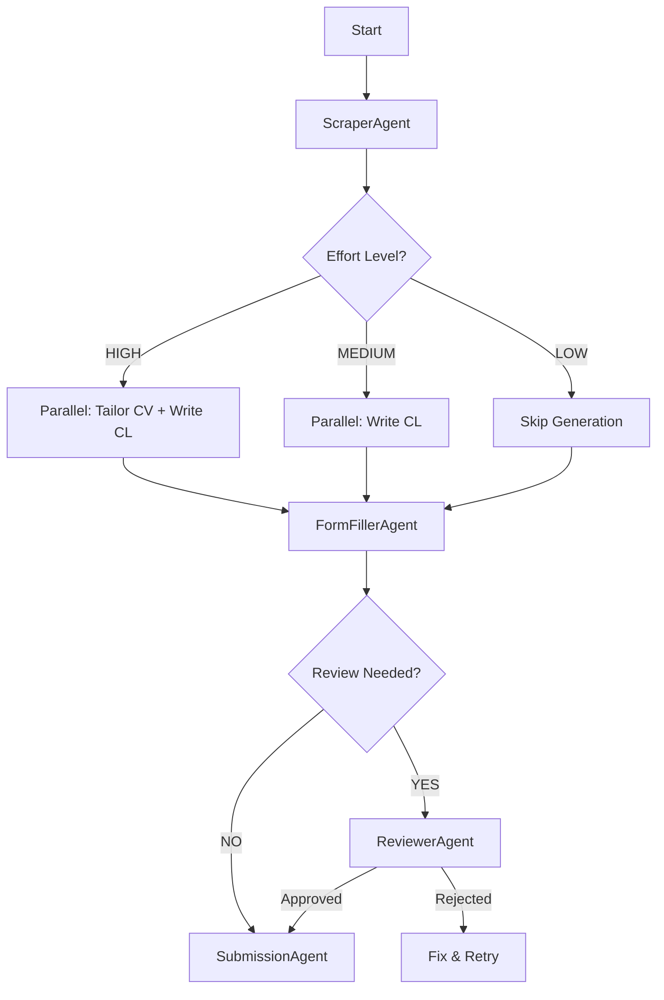

# Agent Skills & Capabilities

This document defines the specialized skills available to the DeepApply agent swarm.

## 🧠 Core Capabilities

### 1. 🕵️ Job Analysis (ScraperAgent)
- **Skill**: `extract_job_requirements`
- **Input**: Job URL
- **Output**: Structured JSON (Role, Company, Key Skills, Experience Level, Salary Range)
- **Description**: Navigates to the URL, bypasses basic auth/popups, and extracts the core job description.

### 2. 📝 Content Generation (WriterAgents)
- **Skill**: `tailor_cv`
- **Input**: Original CV (Markdown/LaTeX), Job Requirements
- **Output**: Modified CV
- **Description**: Re-ranks skills, adjusts summary, and highlights relevant experience to match the JD.

- **Skill**: `write_cover_letter`
- **Input**: User Profile, Job Requirements
- **Output**: Personalized Cover Letter
- **Description**: Drafts a compelling cover letter connecting the user's background to the specific role.

### 3. 🤖 Form Automation (FormFillerAgent)
- **Skill**: `fill_application_form`
- **Input**: Target URL, User Context (CV + CL)
- **Output**: Filled Form (Ready for Review)
- **Description**: Maps user data to form fields, handles dropdowns, file uploads, and multi-step forms.

### 4. ⚖️ Quality Assurance (ReviewerAgent)
- **Skill**: `review_application`
- **Input**: Filled Form Screenshot / Summary, Generated Documents
- **Output**: Approval (Boolean) + Feedback
- **Description**: Checks for hallucinations, missing fields, or formatting errors before submission.

## ⚡ Parallel Execution Flow

